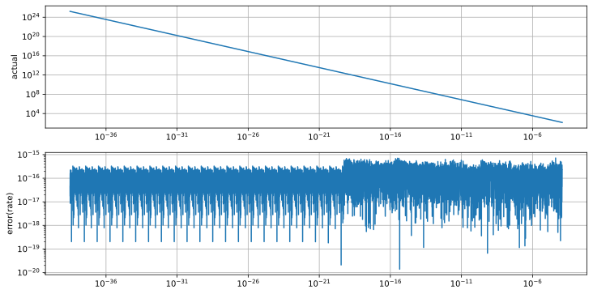

# HoltsmarkDistributionFP64
 HoltsmarkDistribution Double Precision Implement
 
## Landau Distribution
See: [HoltsmarkDistribution](https://github.com/tk-yoshimura/HoltsmarkDistribution)  
Double-Double Precision: [DoubleDoubleStatistic](https://github.com/tk-yoshimura/DoubleDoubleStatistic)  

## Double Precision (IEEE 754) Approx
[C# code](HoltsmarkDistributionFP64/HoltsmarkDistribution.cs)  

## Error

### PDF

  
  

### CDF

  

### Complementary CDF

  

### Quantile

  

### Complementary Quantile

  

## Licence
[CC BY 4.0](https://github.com/tk-yoshimura/HoltsmarkDistributionFP64/blob/main/LICENSE)

If anyone would like to use some of the code in this repository, please contact me with an Issue and let me know.  
[Issue](https://github.com/tk-yoshimura/HoltsmarkDistributionFP64/issues)

## Author

[T.Yoshimura](https://github.com/tk-yoshimura)

## Related Works
[LandauDistributionFP64 &alpha;=1, &beta;=1](https://github.com/tk-yoshimura/LandauDistributionFP64)  
[HoltsmarkDistributionFP64 &alpha;=3/2, &beta;=0](https://github.com/tk-yoshimura/HoltsmarkDistributionFP64)  
[MapAiryDistributionFP64 &alpha;=3/2, &beta;=1](https://github.com/tk-yoshimura/MapAiryDistributionFP64)  